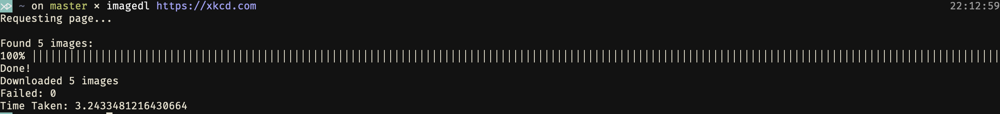

`image_downloader` is a tool to download multiple images in a webpage all at once by python multi-threading.

# Screenshot


# Usage
On your terminal:
```python
imagedl <full url to download images from>

# specify & generate a folder named `foldername_hostname` 
# for holding images under current folder
# default name: `images_hostname` 
imagedl <full url to download images from> -d <foldername you give>

# specify image formats
# default formats: ["jpg", "png", "gif", "svg", "jpeg", "webp"]
imagedl <full url to download images from> --formats png jpg
```


# Installation
```python
pip install image_downloader
```

